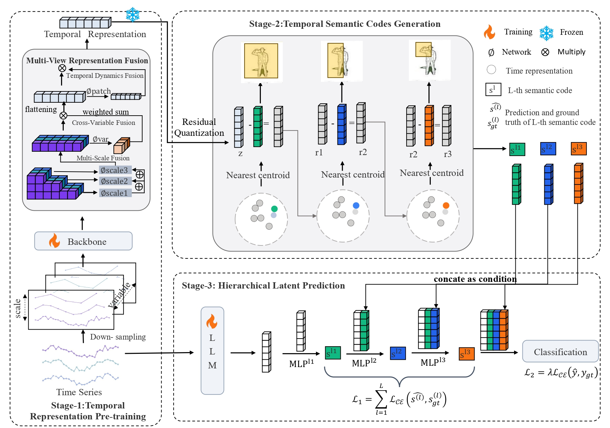

# [ICML 2026] Hi-Time: Hierarchical Latent Prediction for Multivariate Time Series Classification

## Overview

This repository contains the implementation code for *Hi-Time: Hierarchical Latent Prediction for Multivariate Time Series Classification*.

Integrating Large Language Models (LLMs) into time series tasks has yielded impressive performance. While some works aim to enhance accuracy by explicitly designing step-by-step reasoning into prompts, such explicit Chain-of-Thought (CoT) approaches are difficult to generalize to time series. This is because it is difficult to clearly define the reasoning trajectories of time series. In addition, the high heterogeneity across time series often requires specialized prompt designs, limiting the model's scalability.To address these challenges, we propose **Hi-Time**, a **hi**erarchical latent prediction framework based on temporal semantic codes for multivariate **time** series classification. This framework automatically constructs scenario-specific coarse-to-fine prediction trajectories based on the characteristics of time series, thereby providing structured supervision for the LLM.Specifically, Hi-Time first performs temporal representation pre-training with a multi-view temporal representation fusion to acquire high-quality temporal embeddings. We then discretize these temporal embeddings into hierarchical temporal semantic codes that form the coarse-to-fine prediction trajectory. Finally, the LLM predicts temporal semantic codes in a stepwise manner and then infers the final label, thereby establishing a coarse-to-fine decision process.Experiments on ten public multivariate time series datasets demonstrate that Hi-Time effectively adapts to diverse datasets and outperforms state-of-the-art methods.

## The Model Framework of Hi-Time



## Datasets

We follow the benchmark on [TS-GAC](https://github.com/Frank-Wang-oss/TS-GAC) and use 10 datasets: UCI-HAR, ISRUC-S3, and 8 UEA datasets including ArticularyWordRecognition (AWR), FingerMovements (FM), SpokenArabicDigits (SAD), CharacterTrajectories (CT), FaceDetection (FD), InsectWingbeat (IW), MotorImagery (MI), and SelfRegulationSCP1 (SRSCP1).

### UCI-HAR

You can access [here](https://archive.ics.uci.edu/ml/datasets/Human+Activity+Recognition+Using+Smartphones).

### ISRUC-S3

You can access [here](https://sleeptight.isr.uc.pt/), and download S3.

### UEA Datasets

You can access [here](http://timeseriesclassification.com/dataset.php).

This repository includes the FingerMovements dataset as a demo example. To use other datasets, download the corresponding `.npy` files and place them under `data/datasets/<DatasetName>/`:

```
data/datasets/<DatasetName>/
├── X_train.npy
├── y_train.npy
├── X_test.npy
└── y_test.npy
```

## Requirements

Hi-Time has been tested using Python 3.9.

To have consistent libraries and their versions, you can install needed dependencies running the following command:

```bash
pip install -r requirements.txt
```

### Pretrained GPT-2 Weights

Stage 3 requires pretrained GPT-2 weights. Download and place them under `pretrained/gpt2/`:

```
pretrained/gpt2/
├── config.json
└── model.safetensors
```

You can obtain GPT-2 weights from [HuggingFace](https://huggingface.co/openai-community/gpt2). To skip pretrained weights and train from scratch, use the `--no-pretrained` flag.

## Running the Code

To quickly verify the installation, run:

```bash
python train.py --dataset FingerMovements --preset debug
```

### Training

Run the full three-stage pipeline:

```bash
python train.py --dataset FingerMovements
```

### Training without Pretrained GPT-2

```bash
python train.py --dataset FingerMovements --no-pretrained
```

### Available Arguments

| Argument | Default | Description |
|----------|---------|-------------|
| `--dataset` | *(required)* | Dataset name (e.g. `FingerMovements`) |
| `--preset` | `default` | Config preset (`default`, `debug`, or a dataset name) |
| `--seed` | from config (10) | Random seed |
| `--device` | auto | Device (`cuda` / `cpu`) |
| `--batch-size` | from config | Training batch size |
| `--no-pretrained` | `false` | Train GPT-2 from scratch |
| `--gpt2-model` | `./pretrained/gpt2` | Path to pretrained GPT-2 weights |
| `--no-resplit` | `false` | Disable 60/20/20 merge-resplit |
| `--codebook-size` | from config (64) | Codebook size *K* for residual quantization |
| `--num-quantize-layers` | from config (3) | Number of quantization layers *L* |

Key hyperparameters can be adjusted in `configs/base_config.py`:

- *batch_size*: Training batch size
- *patch_len*: Patch length, corresponding to *P* in the paper
- *stride*: Stride of patch
- *d_model*: Model hidden dimension
- *n_heads*: Number of heads in multi-head attention
- *n_layers*: Number of transformer layers
- *codebook_size*: Codebook size *K* for residual quantization
- *num_quantize_layers*: Number of quantization layers *L*
- *scales*: Multi-scale patch scales (default: [1, 2, 4])


